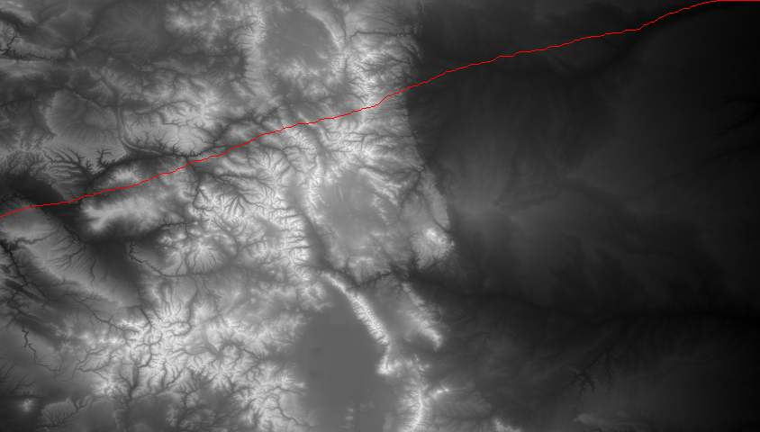

# Terrain Pathfinding Algorithm

A Python-based pathfinding application that finds optimal routes across mountainous terrain using real USGS topographic data.

## 🎯 Project Overview

This project processes elevation data from the U.S. Geological Survey to:
- Generate grayscale visualizations of terrain (480×844 elevation grid)
- Compute optimal west-to-east paths across mountains
- Minimize elevation change using a greedy search algorithm
- Validate results through quantitative cost metrics

## 🖼️ Sample Output


*Grayscale visualization of Colorado terrain*


*Optimal path (in red) minimizing elevation change*

## 🚀 Features

- **Data Processing**: Reads and processes 400,000+ elevation data points from USGS datasets
- **Pathfinding Algorithm**: Greedy search strategy that evaluates 3 directional choices per step
- **Visualization**: Converts elevation data to grayscale images with path overlays
- **Cost Metrics**: Calculates total elevation change to measure path efficiency
- **Modular Design**: Clean, function-based architecture for maintainability

## 🛠️ Technologies Used

- **Python 3.x**
- **PIL/Pillow** - Image processing and visualization
- **Real USGS topographic data** - Colorado elevation dataset

## 📋 How It Works

### Algorithm Logic
1. **Start**: Begin at the middle row of the western (left) edge
2. **Evaluate**: At each step, look at three options:
   - Forward (same row)
   - Forward-up (row - 1)
   - Forward-down (row + 1)
3. **Decide**: Choose the direction with the smallest elevation change
4. **Repeat**: Continue east until reaching the opposite edge

### Cost Metric
**Total Elevation Change** = Sum of absolute elevation differences between consecutive steps
- Lower values indicate flatter, more efficient paths
- Directly measures what the algorithm optimizes for

## 🎮 Usage

### Prerequisites
pip install Pillow

### Running the Program
python main.py

### Output Files
- `elevation_map.png` - Grayscale terrain visualization
- `best_path_map.png` - Terrain with optimal path in red
- `best_path.dat` - Path coordinates (row, col, elevation)
- `best_path_metric.txt` - Cost metric data

## 📁 Project Structure

```
terrain-pathfinding/
│
├── main.py                    # Main program
├── colorado.dat               # Elevation data (844×480 grid)
├── README.md                  # This file
│
├── elevation_map.png          # Generated grayscale map
├── best_path_map.png          # Map with path overlay
├── best_path.dat              # Path coordinates
└── best_path_metric.txt       # Cost metric
```

## 🧠 Key Learnings

- **Problem Decomposition**: Breaking complex tasks into manageable functions
- **Algorithm Design**: Implementing greedy search strategies for optimization
- **Data Visualization**: Converting numerical data into interpretable images
- **File I/O**: Reading/writing data files and processing large datasets

## 📊 Results

The algorithm successfully finds paths that minimize elevation change:
- Processes 844 columns × 480 rows of elevation data
- Evaluates ~2,500 directional choices for a complete path
- Generates quantifiable metrics for path comparison

## CREDITS
ANGELO M SSALI
---

⭐ If you found this project interesting, please consider giving it a star!
